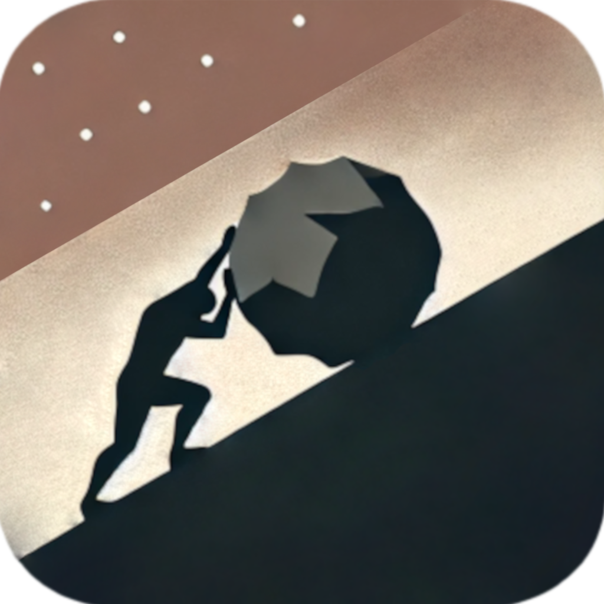

# 🎮 SENSE: The Game Modloader

# Project Compilation Guide

## Windows

### x86_64 build

``` bat
cmake -S app/src/main -B build_x86_64 -G "Visual Studio 17 2022" ^
  -A x64 ^
  -DBUILD_SHARED_LIBS=ON ^
  -DCMAKE_BUILD_TYPE=Release ^
  -DCMAKE_INSTALL_PREFIX=build/release_x86_64 ^
  -D CMAKE_C_FLAGS="/D_WIN32_WINNT=0x0601 /DNTDDI_VERSION=0x06010000" ^
  -D CMAKE_CXX_FLAGS="/D_WIN32_WINNT=0x0601 /DNTDDI_VERSION=0x06010000"

cmake --build build_x86_64 --config Release
cmake --install build_x86_64
```

## 🧑‍💻 Authors

- [IPOleksenko](https://github.com/IPOleksenko) (owner) — Developer and creator of the idea.

## 📜 License

This project is licensed under the [MIT License][license].

[license]: ./LICENSE

---

> _"One must imagine Sisyphus happy."_ — Albert Camus
